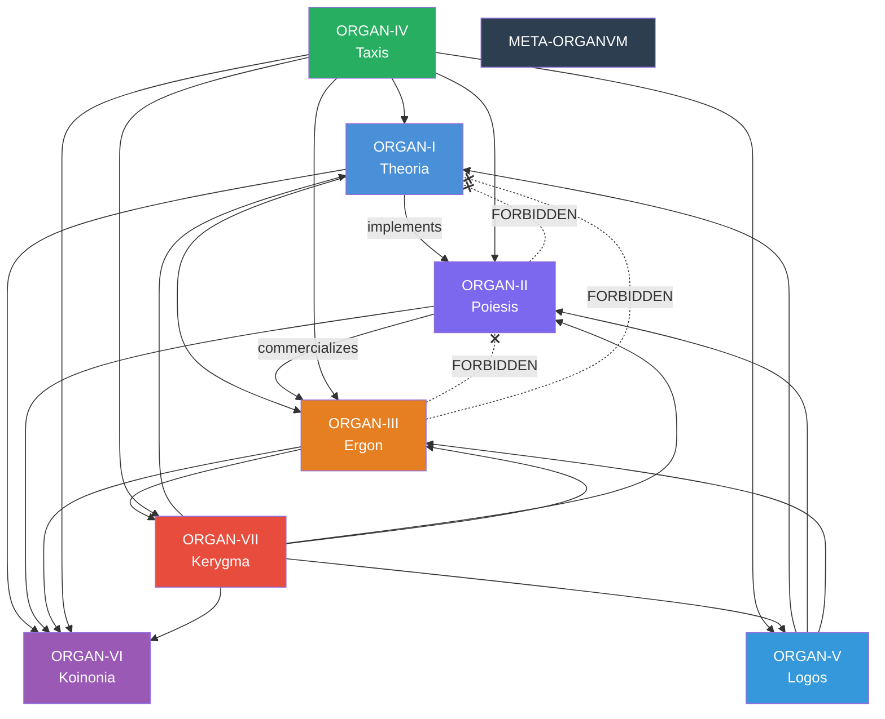

# ORGAN-IV: Orchestration System (Parallel Launch)

> **⚠ HISTORICAL DOCUMENT (2026-02-03).** The orchestration design is implemented and running. Repo count is now 97 (not 44). Current system state lives in [`repo-registry.json`](../../repo-registry.json). Workflow specs are live at [`orchestration-start-here`](https://github.com/organvm-iv-taxis/orchestration-start-here).

**Status:** Design Document (Ready to Implement)  
**Version:** 2.0 (Parallel All-Organs Deployment)  
**Launch Model:** All 8 organs operational simultaneously  
**Created:** 2026-02-03  
**Owner:** You (@4444j99)

> **Post-Cross-Validation (2026-02-09):** Launch criteria, audit cadence, practitioner comparables, and NSF grant target in this document have been updated per `08-canonical-action-plan.md`. Rigid per-organ repo counts replaced with exploration-first approach (D-02, D-07). Monthly audit → quarterly (§6). This document is retained for its governance rules and dependency model.

---

## Executive Summary

The eight-organ system launches all at once (not sequentially). ORGAN-IV serves as the **coordination layer and meta-documentation hub** that makes visible:

1. **How all 8 organs relate to each other** (dependency mapping)
2. **When work moves between organs** (promotion criteria)
3. **How the system validates itself** (health checks)
4. **Why this structure exists** (governance rationale)

**Critical strategic insight:** The meta-system documentation (registry.json, orchestration-system-v2.md, github-actions-spec.md) is itself the primary portfolio asset. For grants (Knight Foundation, Mellon, NEA), AI hiring (Anthropic, OpenAI), and residencies (Eyebeam, Somerset House), this documentation demonstrates:

- Architectural reasoning and systems thinking
- Organizational capacity and digital sustainability
- Transparency and governance-first design
- Production-ready thinking and trade-off analysis

This approach aligns with how leading practitioners (Julian Oliver, Nicky Case, Hundred Rabbits) present their work: **protocols and governance structures as primary artistic output**, not supplementary documentation (updated per `08-canonical-action-plan.md` §7).

---

## Parallel Launch vs. Sequential

### Why Parallel?

**Sequential approach (original plan):**
- Sprint 1: Lock ORGAN-I → validate
- Sprint 2: Lock ORGAN-III → validate
- Sprint 3: Lock ORGAN-II → validate
- Sprint 4: Activate ORGAN-IV cross-organ workflows
- Problem: Applications (grants/hiring) don't see full system until Sprint 4+

**Parallel approach (revised):**
- All 8 organs documentation complete → validate micro (per-organ)
- Day 1: All organs launch + ORGAN-IV orchestration workflows active
- Day 1: Meta-system visible and operational for external evaluation
- Applications can reference complete, integrated system

### Simultaneous Launch Architecture

```
ORGAN-I (Theory)
├─ 10 repos + comprehensive READMEs
├─ Public via GitHub + ORGAN-V essays

ORGAN-II (Art)
├─ 13 repos + case studies + portfolio
├─ Cross-linked to ORGAN-I implementations
├─ ORGAN-V documents artistic methodology

ORGAN-III (Commerce)
├─ 12 repos + revenue metrics + governance
├─ Private governance layer (commerce--meta)
├─ ORGAN-V case studies + retrospectives

ORGAN-IV (Orchestration) ← COORDINATES ALL
├─ registry.json (all 44 repos + relationships)
├─ governance-rules.json (promotion criteria)
├─ .github/workflows/ (5 core workflows live)
├─ ORGAN-V essays explain entire system

ORGAN-V (Public Process)
├─ Essays about all 8 organs + meta-system
├─ RSS feed + newsletter
├─ POSSE distribution to Mastodon, LinkedIn, Discord

ORGAN-VI (Community)
├─ Invitation-only collaboration spaces
├─ Indexed salon archive + reading group

ORGAN-VII (Marketing)
├─ Social automation + content distribution
├─ Announcement templates + strategy
└─ Amplifies ORGAN-V content

Meta (Umbrella) ← meta-organvm
├─ Cross-organ coordination hub
├─ System-wide governance and visibility
└─ 0 repos (hub only)

ALL ORGANS CONNECTED VIA:
- Central registry (single source of truth)
- Shared governance rules (promotes transparency)
- Automated health checks (validates system coherence)
- ORGAN-V narrative (describes everything publicly)
```

---

## Governance Rules (Parallel Edition)

### Rule 1: All 8 Organs Represented at Launch

**Each organ has at least one flagship repo fully documented at launch.** Remaining repos may be stubs or in-progress. This is compatible with a tiered (Bronze/Silver/Gold) approach where organs launch at different levels of completeness.

**Minimum launch criteria per organ** (updated per `08-canonical-action-plan.md` D-02, D-07):
- At least one fully documented flagship per organ (I–V mandatory, VI–VII at least stubs)
- Specific repo selections emerge from exploration, not pre-planning
- See `08-canonical-action-plan.md` §3 for Bronze Sprint success criteria

**If any organ has zero documented repos at launch day, delay until at least one flagship per organ is ready.**

### Rule 2: Documentation-First Validation

Before any cross-organ workflows activate:

1. **README audit:** Every repo has comprehensive documentation
   - Problem statement (ORGAN-I)
   - Usage examples (ORGAN-II, III)
   - Governance docs (ORGAN-III, IV)
   - Essay/process docs (ORGAN-V)

2. **Micro-validation:** Each organ functions independently
   - All tests passing in that organ
   - No intra-organ broken dependencies
   - All links resolving (README → code → docs)
   - All examples executable

3. **Cross-organ validation:** Relationships declared in registry
   - Dependencies map correctly (ORGAN-I → II → III)
   - No circular deps detected
   - Transitive depth within limits
   - All back-references working

4. **Meta-documentation validation:** ORGAN-V explains everything
   - Essays published for each organ's purpose
   - Meta-system essay explains orchestration
   - Registry + governance docs linked from essays
   - RSS feed generating correctly

### Rule 3: Registry as Single Source of Truth

The central registry.json (in ORGAN-IV) is authoritative for:

- What repos exist and their status
- Which organ each repo belongs to
- Dependencies between repos
- Cross-organ participation (repos spanning 2 organs)
- Portfolio relevance scores (for external visibility)
- Documentation status (README complete? Case study needed? etc.)

**Every other system reads from registry. Registry is never wrong.**

All workflows validate against registry before executing.

### Rule 4: Meta-System Documentation as Portfolio Asset

Documentation itself is a deliverable, not overhead:

- **For hiring (AI labs):** Registry + orchestration-system-v2.md + github-actions-spec.md demonstrate architectural reasoning, trade-off analysis, production thinking
- **For grants:** ORGAN-V essays + registry show organizational capacity and digital sustainability (Knight Foundation model)
- **For residencies:** Governance + community infrastructure (ORGAN-VI) show ecosystem contribution

### Rule 5: Parallel Organ Dependencies

With all organs live simultaneously, dependencies flow:

```
ORGAN-I (Theory)
    ↓ (implements)
ORGAN-II (Art)
    ↓ (commercializes)
ORGAN-III (Commerce)
    ↙ ↓ ↘
  (all document via)
ORGAN-V (Public Process)
    ↓ (amplifies via)
ORGAN-VII (Marketing)
    ↑ (community powered by)
ORGAN-VI (Community)
    ↑ (enabled by)
ORGAN-IV (Orchestration)
    ↑ (umbrella over all)
Meta (meta-organvm)
```

**All connections active from day 1.** No sequential "cascading activation."

---

## State Machines

### Repo Promotion State Machine (Invariant #6)

Repos that move between organs follow a formal promotion pathway:

```
LOCAL → CANDIDATE → PUBLIC_PROCESS → GRADUATED → ARCHIVED
```

| State | Meaning | Location | Duration |
|-------|---------|----------|----------|
| LOCAL | Under development, not yet proposed for promotion | Source organ | Indefinite |
| CANDIDATE | Proposed for cross-organ promotion; under review | Source organ | 1–2 weeks |
| PUBLIC_PROCESS | Documented via ORGAN-V; publicly visible | Source + ORGAN-V | 1–4 weeks |
| GRADUATED | Successfully promoted to destination organ | Destination organ | Indefinite |
| ARCHIVED | No longer actively maintained; preserved read-only | Original org | Indefinite |

**This state machine governs cross-organ promotion (e.g., Theory→Art, Art→Commerce). It does NOT describe day-to-day repo status.**

### Repo Documentation Status (Registry Vocabulary)

The `repo-registry.json` uses a separate vocabulary for current repo state:

| Value | Meaning |
|-------|---------|
| ACTIVE | Maintained, code exists, under development |
| DEPLOYED | In production, serving users |
| SKELETON | Repo exists with minimal structure, no substantive content |
| EMPTY | Repo created but contains nothing meaningful |

These two vocabularies serve different purposes: the promotion state machine tracks movement between organs; the documentation status tracks current readiness.

---

## Promotion Criteria (Revised for Parallel)

### Movement Between Organs (Ongoing, Not Launch-Time)

Parallel launch doesn't change promotion criteria, but it means:

1. **Theory → Art happens continuously**
   - Theory repo can be implemented in Art at any time
   - Proposal: label repo `ready-for-implementation`
   - ORGAN-II team responds with implementation or declination

2. **Art → Commerce happens opportunistically**
   - Art system can be commercialized anytime
   - Proposal: label repo `ready-for-commercialization`
   - ORGAN-III team evaluates business model

3. **All → Public Process happens regularly**
   - Any system can be documented publicly
   - Trigger: issue in ORGAN-V repo with source repo link
   - Automation: `publish-process.yml` creates essay draft

4. **Public Process → Marketing happens continuously**
   - ORGAN-V essays amplified on publication
   - Trigger: label `ready-to-distribute` 
   - Automation: POSSE distribution to all platforms

### Example: Art System Promotion at Any Time (Post-Launch)

Day 1 (Launch): ORGAN-II repo `core-engine` is operational, documented, live.

Day 30: Author realizes `core-engine` + `performance-sdk` could become a commercial training platform.

Process:
1. Open issue: "Promote to Commerce: core-engine → performance-training"
2. Validation: Check against promotion criteria
   - Does it have 3+ documented use cases? ✅
   - Is pricing defined? ✅
   - Is support model documented? ✅
3. Auto-action: Create `performance-training` repo in organvm-iii-ergon
4. Link: Update registry with promotion record
5. Notify: ORGAN-VII publishes "New Commercial Platform Launch"

---

## Orchestration Rules (Parallel Model)

### Rule: ORGAN-IV Is the Visible Coordinator

ORGAN-IV repos are intentionally somewhat public to demonstrate orchestration:

- `orchestration-start-here` (PUBLIC) — Registry + governance visible
- `system-governance-framework` (SEMI-PUBLIC) — Governance rules documented
- `cognitive-archaelogy-tribunal` (SEMI-PUBLIC) — Audit tool specs

**Why?** External evaluators (grant committees, hiring managers) need to *see* how you orchestrate. This is evidence of systems thinking.

### Rule: ORGAN-V Explains ORGAN-IV

ORGAN-V public essays make explicit:

- Why the eight-organ model exists
- How ORGAN-IV coordinates all others
- What registry.json contains and why
- How promotion criteria work
- Why this structure enables sustained creative work

This is meta-documentation as narrative. It's both artifact and explanation.

### Rule: Health Checks Run Across All Organs Simultaneously

Quarterly audit (via `monthly-organ-audit.yml`, renamed cadence per `08-canonical-action-plan.md` §6):

```
Check ORGAN-I:
  - All 10 repos have current READMEs
  - Cross-references to ORGAN-II implementations valid
  - No undocumented repos

Check ORGAN-II:
  - All 13 repos working examples present
  - Portfolio and case studies current
  - Cross-links to ORGAN-I theory valid

Check ORGAN-III:
  - All 12 repos have SLAs documented
  - Revenue tracking sheet current
  - No security/governance issues

Check ORGAN-IV:
  - Registry accurate
  - All 44 repos mapped
  - Workflows passing

Check ORGAN-V:
  - Essays published in past 30 days
  - Engagement metrics tracked
  - Links all working

Check ORGAN-VI:
  - Community members active
  - Contribution records current

Check ORGAN-VII:
  - Distribution metrics tracked
  - Audience growth documented

Check Meta:
  - Umbrella org visible and linked
  - Cross-org governance consistent

REPORT:
  - One issue per organ (if any)
  - System health: % operational
  - Recommendations for next month
```

---

## Dependency Model (All 8 Simultaneous)

### Intra-Organ Dependencies

**ORGAN-I (Theory):**
- 10 repos, most independent
- Some depend on others (e.g., radix-recursiva depends on a-recursive-root)
- Validation: Ensure all working theory can be tested independently

**ORGAN-II (Art):**
- All depend on ORGAN-I (implements theory)
- core-engine is foundation; others layer on top
- Validation: Tests in ORGAN-II prove ORGAN-I theories work

**ORGAN-III (Commerce):**
- All depend on ORGAN-I or ORGAN-II (or both)
- Independent deployability required (can run commerce product without rebuilding art)
- Validation: ORGAN-III products work in isolation

**ORGAN-IV (Orchestration):**
- Depends on everyone (reads registry of all organs)
- No dependencies on ORGAN-IV from other organs (clean separation)

**ORGAN-V (Public Process):**
- Depends on all (documents all organs)
- No dependencies on ORGAN-V from other organs (optional layer)

**ORGAN-VI (Community):**
- Facilitates work in other organs
- No hard dependencies (invitation-only, opt-in)

**ORGAN-VII (Marketing):**
- Amplifies ORGAN-V content
- No dependencies on ORGAN-VII from other organs (optional)

### Cross-Organ Dependency Graph (Validated in Registry)

```
ORGAN-I (10 repos)
  │
  └─→ ORGAN-II (13 repos)
        │
        └─→ ORGAN-III (12 repos)
              │
              └─→ Public visibility via ORGAN-V (1 repo)
                    │
                    └─→ Amplified via ORGAN-VII (3 repos)

ORGAN-IV (3 repos) observes all of the above
ORGAN-VI (2 repos) facilitates all of the above
Meta (0 repos) umbrella over all of the above
```

**No back-edges.** ORGAN-III cannot depend on ORGAN-II output; ORGAN-II cannot depend on ORGAN-III. Unidirectional only (with exception for orchestration/documentation layers).

#### Dependency Graph (from `governance-rules.json`)



---

## Meta-System Documentation as Strategic Asset

### For AI Systems Engineering Roles

**Hiring managers evaluate:** Production-ready thinking, architectural reasoning, trade-off analysis.

**Lead with ORGAN-IV documentation:**
- Show registry.json and explain design choices (why JSON over YAML? Why this schema?)
- Walk through orchestration-system-v2.md: Why these promotion criteria? What happens if someone violates dependency rules?
- Discuss github-actions-spec.md: What trade-offs between automation vs. manual review? Why these specific workflows?

**This demonstrates:**
- Thinking in systems not fragments
- Capacity to handle complexity and ambiguity
- Production experience (not just theory)
- Clear communication of technical decisions

### For Grant Funding (Knight Foundation, Mellon, NSF)

**Reviewers evaluate:** Organizational capacity, long-term sustainability, demonstrated infrastructure.

**Lead with ORGAN-V essays + registry:**
- "How I Orchestrate Eight Organs" essay explains the whole system
- Registry.json is evidence of systematic approach
- Show how ORGAN-IV enables ongoing work (it's not just current projects; it's a system for future projects)

**Scoring:**
- Knight Foundation "Art + Tech Expansion": Long-term capacity ✅ (infrastructure that enables future work)
- Mellon "Arts & Culture": Organizational sustainability ✅ (documented governance)
- ~~NSF "Convergence Accelerator"~~: Deprioritized per `08-canonical-action-plan.md` §6 (requires team-led consortium; poor fit for solo operator). Retained as reference.

### For Residencies and Fellowships (Eyebeam, Somerset House, Processing)

**Evaluators assess:** Community contribution, reusable infrastructure, systemic thinking.

**Present all 8 organs as unified ecosystem:**
- ORGAN-VI: Community participation and facilitation
- ORGAN-V: Transparent public documentation
- ORGAN-IV: Governance model that others can learn from
- All organs: Evidence of artist-engineer hybrid practice

**Eyebeam specifically values:** "Equitable systems in support of creativity." Your eight-organ model + public documentation = evidence of systemic thinking.

---

## Documentation is the Connective Tissue

### The Registry as Narrative Device

registry.json is not just a data file. It's a **story about how your work organizes itself:**

```json
{
  "ORGAN-I": "Here's the theoretical foundation",
  "ORGAN-II": "Here's how theory becomes art",
  "ORGAN-III": "Here's how art becomes product",
  "ORGAN-IV": "Here's how it all stays coherent",
  "ORGAN-V": "Here's what we're learning publicly",
  "ORGAN-VI": "Here's who's participating",
  "ORGAN-VII": "Here's who's seeing it",
  "Meta": "Here's the umbrella that holds it all together"
}
```

For external evaluators, this registry is proof of systems thinking. It answers: "How do you actually manage 44 repos? How do you keep them coherent? What happens when things break? How do you know the system is healthy?"

### The Essays as Explanation

ORGAN-V essays aren't optional. They're where you:
- Explain why eight organs (not six, not ten)
- Describe the promotion pipeline in plain language
- Document decisions and trade-offs
- Show what you've learned by building this

These essays are portfolio material. They're evidence of reflection, maturity, and systems thinking.

---

## Parallel Launch Checklist

**Before Day 1:**

**Phase 1: Documentation Audit (Sprints 1-2)**
- [ ] Comprehensive README for all 44 repos (AI-generated, human-refined)
- [ ] About sections for 8 GitHub orgs (~105K TE)
- [ ] Personal account decisions (~50K TE)
- [ ] 14 local repos migration prep (~135K TE)

**Phase 2: Micro-Validation per Organ (Sprint 3)**
- [ ] ORGAN-I: All 10 repos locked, documented, linked (~135K TE)
- [ ] ORGAN-II: All 13 repos with portfolios + cases (~180K TE)
- [ ] ORGAN-III: All 12 repos with governance + metrics (~150K TE)
- [ ] ORGAN-IV: Orchestration fully specified (~110K TE)
- [ ] ORGAN-V: Public process infrastructure complete (~135K TE)
- [ ] ORGAN-VI: Community repos indexed (~88K TE)
- [ ] ORGAN-VII: Distribution strategy documented (~88K TE)
- [ ] Meta: Umbrella org visible and linked (~15K TE)

**Phase 3: Parallel Cross-Organ Validation (Sprint 4)**
- [ ] All 44 repos in registry, status verified (~88K TE)
- [ ] Dependency graph validated (no cycles, correct depth) (~88K TE)
- [ ] All back-references working (READMEs link correctly) (~50K TE)
- [ ] All 5 workflows tested successfully (~135K TE)
- [ ] ORGAN-V essays published (Theory essay, orchestration essay, etc.) (~600K TE)

**Day 1: Parallel Launch**
- [ ] All 8 organs go live simultaneously
- [ ] Central registry published
- [ ] Governance docs public
- [ ] GitHub Actions workflows active
- [ ] ORGAN-V essays distributed to audience
- [ ] POSSE automation begins

---

## Success Metrics

**At launch:**
- [ ] All 44 repos public + documented
- [ ] Registry complete and accurate
- [ ] No circular dependencies
- [ ] All workflows passing tests
- [ ] ORGAN-V essays published and distributed
- [ ] Community repos accessible

**First month post-launch:**
- [ ] 5+ promotion proposals submitted (Theory→Art, Art→Commerce, etc.)
- [ ] Quarterly audit runs successfully
- [ ] 0 critical alerts in system validation
- [ ] ORGAN-V audience engagement growing
- [ ] External applications (grants/jobs) cite meta-system as differentiator

---

**Status:** Ready to implement (Version 2.0 parallel launch)  
**Owner:** You (@4444j99)  
**Timeline:** ~6.5M TE total budget, criteria-driven (D-08) → all 8 organs launch simultaneously
